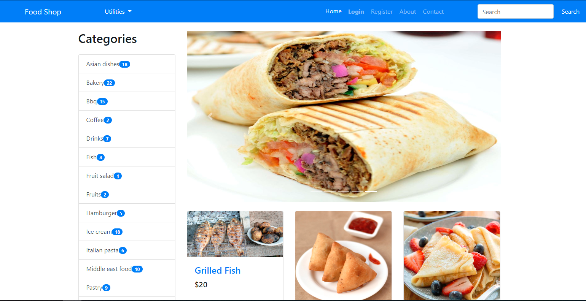
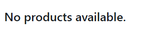
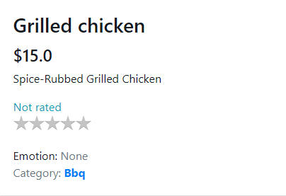
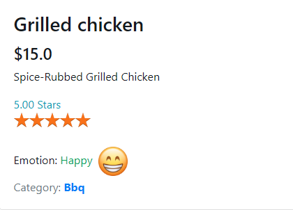
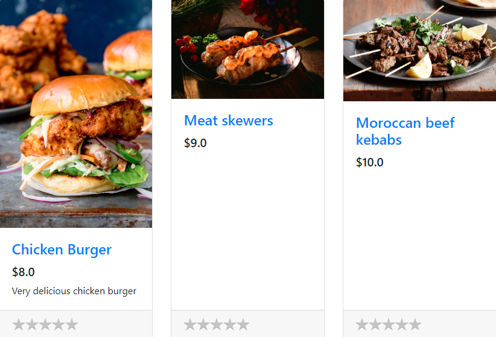

# What is this
- A simple web application that aims to recommend products to customers based on their emotions about other products.
- This was the final project to finish the 3rd year in university.


### Requirements
- **Python 3.6+**
- **Flask 1.0.2** for the entire web app
- **passlib 1.7.1** for hashing passwords
- **Keras 2.2.4** for 5-star sentiment analyzer
- **Tensorflow 1.13.1** Keras backend (atleast in my case)
- **FFmpeg** for converting wav files to 16000Hz sample rate (install [here](http://ffmpeg.org/download.html))
- **SciPy** for the recommender system ( Used Matrix-Factorization )
- **NumPy**
- **Pandas**
```
pip3 install -r requirements.txt
```

# Home Page

<p style="text-align: center;">Figure 1: <b>Home page</b></p>

The customer at first is going to register for a new user and fill the form shown in **Figure 2**, once finished, you can see when he/she clicks at "Recommended Products" in the navigation bar shown in  **Figure 3**, no products and content will be shown, that is because no rating ( or emotion ) has been successfully registered by the customer, the page will show as captured in **Figure 4**


<p style="text-align: center;">Figure 2: <b>Registration Form</b></p>


<p style="text-align: center;">Figure 3: <b>Navigation Bar</b></p>


<p style="text-align: center;">Figure 4: <b>No products available</b></p>

When the user likes a dish, for example let us say "Grilled Chicken", he/she needs to click the card of the specified product as displayed in **Figure 5**, once finished, a new page will appear with a high quality image of the dish he chose, he/she can now express his/her emotion and rating ( Note that the recognizer will detect the emotion and star rating in **speech tone** and **not text** ) about that food using the microphone.
At first no emotion will be visible as shown in **Figure 6**, but when the four seconds of recording is completed, the system will automatically capture the emotion & star rating and will show the results very clearly as shown in **Figure 7**


<p style="text-align: center;">Figure 5: <b>The desired example food chosen by a customer</b></p>


<p style="text-align: center;">Figure 6: <b>The emotion status before expressing any emotion</b></p>


<p style="text-align: center;">Figure 7: <b>Navigation Bar</b></p>


When the customer now wants to view his recommended products in the navbar mentioned earlier, the top three dishes actually contains chicken and meat as shown in **Figure 8**


<p style="text-align: center;">Figure 8: <b>Top 3 Recommended Dishes to the Chicken fan</b></p>


# Models used
- **Star review rating**: Converts 3 emotions ( sad, neutral and happy ) to a number between 0 and 5
- **Emotion Recognizer**: Different models for different emotion sets, such as (sad, neutral and happy) or (angry, sad, neutral, surprised, happy), etc.
Accomplished with the help of this [repository](https://github.com/x4nth055/emotion-recognition-using-speech).
- **Recommender System**: A model that recommend products based on review ratings about products, the method used is [Matrix Factorization](https://en.wikipedia.org/wiki/Matrix_factorization_(recommender_systems)) and the code is in `recommender/core.py`

# Thanks to
- [Anis LC00L](https://github.com/AnisLcool) for helping me accomplish this college project.

